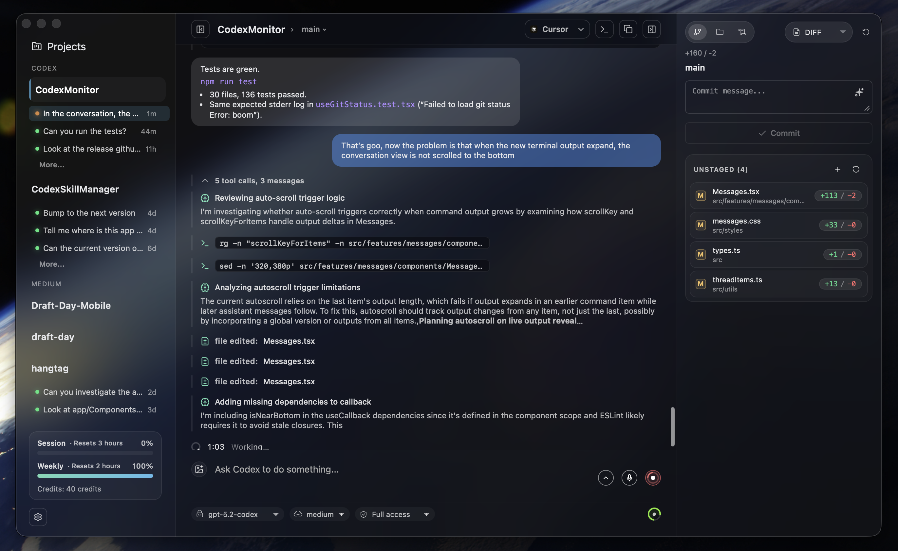

# CodexMonitor



CodexMonitor 是一个用于在本地工作区中协调多个 Codex 代理的 Tauri 应用。它提供了一个侧边栏来管理项目，一个用于快速操作的主屏幕，以及一个基于 Codex app-server 协议的对话视图。

## 功能特性

### 工作区与线程

- 添加并持久化工作区，对其进行分组/排序，并从主仪表板跳转到最近的代理活动。
- 为每个工作区启动一个 `codex app-server`，恢复线程，并跟踪未读/运行状态。
- Worktree 和克隆代理用于隔离工作；worktree 位于应用数据目录下（支持传统的 `.codex-worktrees`）。
- 线程管理：固定/重命名/归档/复制、每个线程的草稿，以及停止/中断进行中的对话轮次。
- 可选的远程后端（守护进程）模式，用于在另一台机器上运行 Codex。
- 远程设置助手，用于自托管连接（Orbit 操作 + Tailscale 检测/TCP 模式的主机引导）。

### 撰写器与代理控制

- 支持队列和图片附件的撰写（选择器、拖放、粘贴）。
- 技能（`$`）、提示词（`/prompts:`）、审查（`/review`）和文件路径（`@`）的自动补全。
- 模型选择器、协作模式（启用时）、推理努力、访问模式和上下文使用环。
- 听写功能，支持按住说话快捷键和实时波形图（Whisper）。
- 渲染推理/工具/差异项目，并处理批准提示。

### Git 与 GitHub

- 差异统计、暂存/未暂存文件差异、还原/暂存控制和提交日志。
- 分支列表，支持检出/创建以及上游 ahead/behind 计数。
- 通过 `gh` 查看 GitHub Issues 和 Pull Requests（列表、差异、评论），并在浏览器中打开提交/PR。
- PR 撰写器：发送 PR 上下文到新的代理线程。

### 文件与提示词

- 文件树，支持搜索、文件类型图标，以及在 Finder/Explorer 中显示。
- 提示词库用于全局/工作区提示词：创建/编辑/删除/移动，并在当前或新线程中运行。

### UI 与体验

- 可调整大小的侧边栏/右侧/计划/终端/调试面板，尺寸持久化。
- 响应式布局（桌面/平板/手机），带标签导航。
- 侧边栏使用量和积分计量器，用于账户速率限制，以及主屏幕使用量快照。
- 带有多个标签页的终端停靠栏，用于后台命令（实验性）。
- 应用内更新，带有 toast 驱动的下载/安装、调试面板复制/清除、声音通知，以及平台特定的窗口效果（macOS 叠加标题栏 +  vibrancy）和减少透明度的开关。

## 环境要求

- Node.js + npm
- Rust 工具链（stable）
- CMake（用于原生依赖；听写/Whisper 使用它）
- LLVM/Clang（在 Windows 上需要，用于通过 bindgen 构建听写依赖）
- Codex CLI 已安装并在 `PATH` 中可用为 `codex`（或在应用/工作区设置中配置自定义 Codex 二进制文件）
- Git CLI（用于 worktree 操作）
- GitHub CLI（`gh`）用于 GitHub Issues/PR 集成（可选）

如果遇到原生构建错误，请运行：

```bash
npm run doctor
```

## 快速开始

安装依赖：

```bash
npm install
```

在开发模式下运行：

```bash
npm run tauri:dev
```

## iOS 支持（进行中）

iOS 支持正在开发中。

- 当前状态：移动端布局已运行，远程后端流程已连接，iOS 默认使用远程后端模式。
- 当前限制：终端和听写功能在移动端构建中仍然不可用。
- 桌面行为不变：macOS/Linux/Windows 保持本地优先，除非明确选择远程模式。

### iOS + Tailscale 设置（TCP）

在通过 Tailscale tailnet 将 iOS 应用连接到桌面托管的守护进程时使用此方法。

1. 在桌面和 iPhone 上安装并登录 Tailscale（同一个 tailnet）。
2. 在桌面版 CodexMonitor 中，打开 `设置 > 服务器`。
3. 保持 `远程提供者` 设置为 `TCP (wip)`。
4. 设置一个 `远程后端令牌`。
5. 使用 `启动守护进程` 启动桌面守护进程（在 `移动端访问守护进程` 中）。
6. 在 `Tailscale 助手` 中，使用 `检测 Tailscale` 并记下建议的主机名（例如 `your-mac.your-tailnet.ts.net:4732`）。
7. 在 iOS 版 CodexMonitor 中，打开 `设置 > 服务器`。
8. 将 `连接类型` 设置为 `TCP`。
9. 输入桌面 Tailscale 主机名和相同的令牌。
10. 点击 `连接并测试` 并确认成功。

注意：

- iOS 连接时，桌面守护进程必须保持运行。
- 如果测试失败，确认两台设备都在 Tailscale 中在线，且主机名/令牌与桌面设置匹配。
- 如果想使用 Orbit 而不是 Tailscale TCP，在 iOS 上将 `连接类型` 切换为 `Orbit`，并使用桌面 Orbit websocket URL/令牌。

### iOS 前提条件

- 已安装 Xcode + Command Line Tools。
- 已安装 Rust iOS 目标：

```bash
rustup target add aarch64-apple-ios aarch64-apple-ios-sim
# 可选（Intel Mac 模拟器构建）：
rustup target add x86_64-apple-ios
```

- 已配置 Apple 签名（开发团队）。
  - 在 `src-tauri/tauri.ios.conf.json` 中设置 `bundle.iOS.developmentTeam`（推荐），或
  - 将 `--team <TEAM_ID>` 传递给设备脚本。

### 在 iOS 模拟器上运行

```bash
./scripts/build_run_ios.sh
```

选项：

- `--simulator "<name>"` 指定目标模拟器。
- `--target aarch64-sim|x86_64-sim` 覆盖架构。
- `--skip-build` 重复使用当前应用包。
- `--no-clean` 在构建之间保留 `src-tauri/gen/apple/build`。

### 在 USB 设备上运行

列出可发现的设备：

```bash
./scripts/build_run_ios_device.sh --list-devices
```

在特定设备上构建、安装和启动：

```bash
./scripts/build_run_ios_device.sh --device "<设备名称或标识符>" --team <TEAM_ID>
```

其他选项：

- `--target aarch64` 覆盖架构。
- `--skip-build` 重复使用当前应用包。
- `--bundle-id <id>` 启动非默认的包标识符。

首次设备设置通常需要：

1. iPhone 解锁并信任此 Mac。
2. 在 iPhone 上启用开发者模式。
3. 在 Xcode 中至少批准一次配对/签名。

如果签名尚未准备就绪，从脚本流程中打开 Xcode：

```bash
./scripts/build_run_ios_device.sh --open-xcode
```

### iOS TestFlight 发布（脚本化）

使用端到端脚本进行归档、上传、配置合规、分配测试组，并提交beta审核。

```bash
./scripts/release_testflight_ios.sh
```

脚本自动从 `.testflight.local.env`（git 忽略）加载发布元数据。
对于新设置，将 `.testflight.local.env.example` 复制到 `.testflight.local.env` 并填写值。

## 发布构建

构建生产 Tauri 包：

```bash
npm run tauri:build
```

产物位于 `src-tauri/target/release/bundle/`（平台特定的子文件夹）。

### Windows（可选加入）

Windows 构建是可选的，使用单独的 Tauri 配置文件以避免 macOS 独有的窗口效果。

```bash
npm run tauri:build:win
```

产物位于：

- `src-tauri/target/release/bundle/nsis/`（安装程序 exe）
- `src-tauri/target/release/bundle/msi/`（msi）

注意：在 Windows 上从源码构建需要 LLVM/Clang（用于 `bindgen`/`libclang`），除了 CMake 之外还需要。

## 类型检查

运行 TypeScript 检查器（不发射）：

```bash
npm run typecheck
```

注意：`npm run build` 也在打包前端之前运行 `tsc`。

## 验证

推荐的验证命令：

```bash
npm run lint
npm run test
npm run typecheck
cd src-tauri && cargo check
```

## 代码库导航

对于任务导向的文件查找（"如果你需要 X，编辑 Y"），请使用：

- `docs/codebase-map.md`

## 项目结构

```
src/
  features/         特征划分的 UI + hooks
  features/app/bootstrap/      应用启动编排
  features/app/orchestration/  应用布局/线程/工作区编排
  features/threads/hooks/threadReducer/  线程 reducer 切片
  services/         Tauri IPC 包装器
  styles/           按区域划分的 CSS
  types.ts          共享类型
src-tauri/
  src/lib.rs        Tauri 应用后端命令注册表
  src/bin/codex_monitor_daemon.rs  远程守护进程 JSON-RPC 进程
  src/bin/codex_monitor_daemon/rpc/  守护进程 RPC 域处理程序
  src/shared/       应用 + 守护进程共享的后端核心
  src/shared/git_ui_core/      git/github 共享核心模块
  src/shared/workspaces_core/  工作区/worktree 共享核心模块
  src/workspaces/   工作区/worktree 适配器
  src/codex/        codex app-server 适配器
  src/files/        文件适配器
  tauri.conf.json   窗口配置
```

## 注意事项

- 工作区持久化到应用数据目录下的 `workspaces.json`。
- 应用设置持久化到应用数据目录下的 `settings.json`（主题、后端模式/提供者、远程端点/令牌、Codex 路径、默认访问模式、UI 缩放）。
- UI 中支持功能设置，并在加载/保存时同步到 `$CODEX_HOME/config.toml`（或 `~/.codex/config.toml`）。稳定功能：协作模式（`features.collaboration_modes`）、人格（`personality`）、Steer 模式（`features.steer`）和后台终端（`features.unified_exec`）。实验性功能：Collab 模式（`features.collab`）和应用（`features.apps`）。
- 启动时和窗口聚焦时，应用会为每个工作区重新连接并刷新线程列表。
- 线程通过使用工作区 `cwd` 过滤 `thread/list` 结果来恢复。
- 选择线程总是调用 `thread/resume` 从磁盘刷新消息。
- CLI 会话在 `cwd` 与工作区路径匹配时出现；除非恢复，否则不会实时流式传输。
- 应用通过 stdio 使用 `codex app-server`；参见 `src-tauri/src/lib.rs` 和 `src-tauri/src/codex/`。
- 远程守护进程入口点是 `src-tauri/src/bin/codex_monitor_daemon.rs`；RPC 路由位于 `src-tauri/src/bin/codex_monitor_daemon/rpc.rs`，域处理程序位于 `src-tauri/src/bin/codex_monitor_daemon/rpc/`。
- 共享域逻辑位于 `src-tauri/src/shared/`（特别是 `src-tauri/src/shared/git_ui_core/` 和 `src-tauri/src/shared/workspaces_core/`）。
- Codex 主目录从工作区设置（如果已设置）解析，然后是传统的 `.codexmonitor/`，然后是 `$CODEX_HOME`/`~/.codex`。
- Worktree 代理位于应用数据目录下（`worktrees/<workspace-id>`）；传统的 `.codex-worktrees/` 路径仍然受支持，应用不再编辑仓库的 `.gitignore` 文件。
- UI 状态（面板大小、减少透明度开关、最近线程活动）存储在 `localStorage` 中。
- 自定义提示词从 `$CODEX_HOME/prompts`（或 `~/.codex/prompts`）加载，带有可选的 frontmatter 描述/参数提示。

## Tauri IPC 表面

前端调用位于 `src/services/tauri.ts`，映射到 `src-tauri/src/lib.rs` 中的命令。当前表面包括：

- 设置/配置/文件：`get_app_settings`、`update_app_settings`、`get_codex_config_path`、`get_config_model`、`file_read`、`file_write`、`codex_doctor`、`menu_set_accelerators`。
- 工作区/worktree：`list_workspaces`、`is_workspace_path_dir`、`add_workspace`、`add_clone`、`add_worktree`、`worktree_setup_status`、`worktree_setup_mark_ran`、`rename_worktree`、`rename_worktree_upstream`、`apply_worktree_changes`、`update_workspace_settings`、`update_workspace_codex_bin`、`remove_workspace`、`remove_worktree`、`connect_workspace`、`list_workspace_files`、`read_workspace_file`、`open_workspace_in`、`get_open_app_icon`。
- 线程/轮次/审查：`start_thread`、`fork_thread`、`compact_thread`、`list_threads`、`resume_thread`、`archive_thread`、`set_thread_name`、`send_user_message`、`turn_interrupt`、`respond_to_server_request`、`start_review`、`remember_approval_rule`、`get_commit_message_prompt`、`generate_commit_message`、`generate_run_metadata`。
- 账户/模型/协作：`model_list`、`account_rate_limits`、`account_read`、`skills_list`、`apps_list`、`collaboration_mode_list`、`codex_login`、`codex_login_cancel`、`list_mcp_server_status`。
- Git/GitHub：`get_git_status`、`list_git_roots`、`get_git_diffs`、`get_git_log`、`get_git_commit_diff`、`get_git_remote`、`stage_git_file`、`stage_git_all`、`unstage_git_file`、`revert_git_file`、`revert_git_all`、`commit_git`、`push_git`、`pull_git`、`fetch_git`、`sync_git`、`list_git_branches`、`checkout_git_branch`、`create_git_branch`、`get_github_issues`、`get_github_pull_requests`、`get_github_pull_request_diff`、`get_github_pull_request_comments`。
- 提示词：`prompts_list`、`prompts_create`、`prompts_update`、`prompts_delete`、`prompts_move`、`prompts_workspace_dir`、`prompts_global_dir`。
- 终端/听写/通知/使用量：`terminal_open`、`terminal_write`、`terminal_resize`、`terminal_close`、`dictation_model_status`、`dictation_download_model`、`dictation_cancel_download`、`dictation_remove_model`、`dictation_request_permission`、`dictation_start`、`dictation_stop`、`dictation_cancel`、`send_notification_fallback`、`is_macos_debug_build`、`local_usage_snapshot`。
- 远程后端助手：`orbit_connect_test`、`orbit_sign_in_start`、`orbit_sign_in_poll`、`orbit_sign_out`、`orbit_runner_start`、`orbit_runner_stop`、`orbit_runner_status`、`tailscale_status`、`tailscale_daemon_command_preview`、`tailscale_daemon_start`、`tailscale_daemon_stop`、`tailscale_daemon_status`。
